# Journal for the Print Cards VSTS extension
## Identify the need for a VSTS extension

 **Trey Research** – Small application development company

 **Jamal Hartnett** – Technology Consultant

Our story begins at **Trey Research**, small application development company, and **Jamal**, a technology consultant, demonstrating **Visual Studio Team Services**, a cloud-based collaboration service. Looking for version control, continuous delivery, analytics and agile planning, the teams at Trey Research are showing great interest in the interactive and easy to use Kanban board, and ability to optimize their workflow processes and visualization of their backlogs.

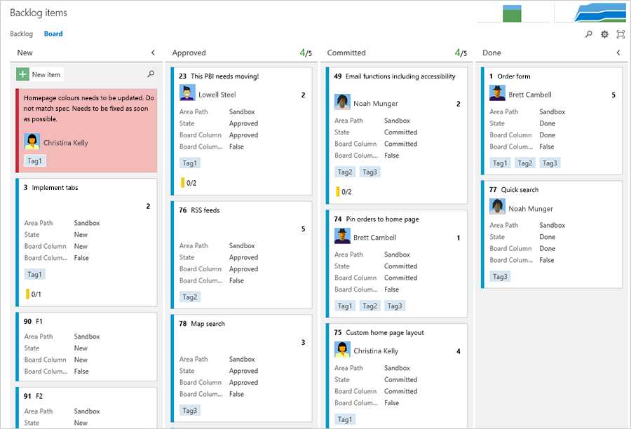

While evaluating and customizing the Kanban board, Jamal documents that Trey Research is missing the ability to print the board, or individual cards on the board for offline viewing and mandated paper-based documentation. He leaves Trey Research with the request to design, develop, test, build and deploy a Visual Studio team Services (VSTS) “Print Cards” extension, to document the process from start to finish, and present a blueprint that will enable Trey Research to build their own extensions.

## Design the VSTS extension

 **Francis Totten** – Development Lead

 **Christie Church** – Subject Matter Expert

Jamal briefs **Francis**, the development lead, and **Christie**, the UX Subject Matter Expert, who produce the following storyboards to enable them to discuss and refine the design:

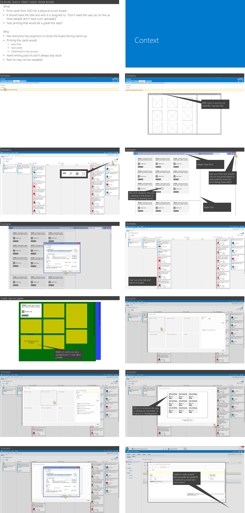

To enable his team to develop the VSTS extension, Francis requests the following Visual Studio Team Services environment from Jamal:

-   VSTS Team Project, named **VSTSExtensions**.
-   **Git** version control system.
-   Work Item **backlog** populated with the following features and stories:
    -   As Christie, the UX SME, I want to design Print Cards Extension
        -   Create **storyboards**
        -   Light-weight design documentation
    -   As Francis, the Dev Lead, I want to blueprint the Print Cards extension from A-Z
        -   Develop the extension
        -   Enable **gated** build
        -   Enable **automated** testing of the extension
    -   As Mateo, the Release Manager, I want to understand the extension deployment
        -   Deploy extension to account
    -   As Trey Research, I want to share the extension
        -   Create a **GitHub** repo
        -   Migrate doc and source control

## **Prepare** the VSTS extension development environment

Based on Francis’ prerequisites, Jamal prepares the development environment on VSTS in 7 simple steps:

1.  [Create a new VSTS account](https://binary-stuff.com/post/create-a-new-vso-account).
2.  Create Team Project **VSTSExtensions**, using [Scrum as the process template](https://msdn.microsoft.com/en-us/library/ff731587.aspx). 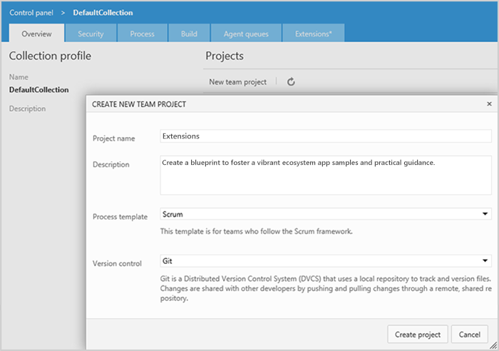
3.  Create Team **Print Cards** and add members. This is an optional step. 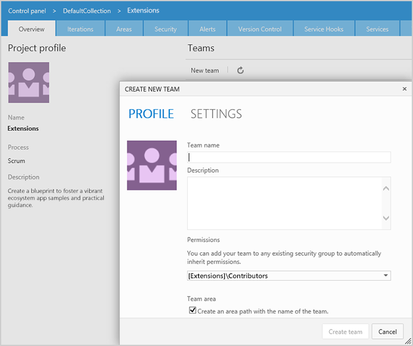
4.  Create and groom the **backlog.** See [Track work with Visual Studio ALM](https://msdn.microsoft.com/en-us/library/dd286619.aspx) and TFS for details. 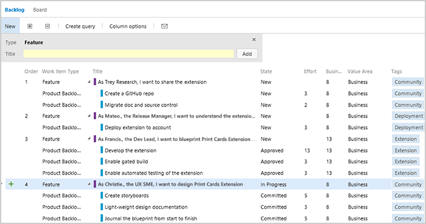
5.  Create custom **queries**, for example Backlog and Debt, and associated graphs. See [Query for work items](https://msdn.microsoft.com/en-us/library/dd286705.aspx) for details. 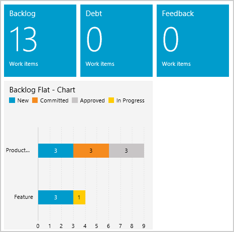
6.  Create **Git repo**sitory and recommended folder structure. See [Use version control](https://msdn.microsoft.com/en-us/library/vstudio/ms181368.aspx) and [Git for TFVC Users](http://vsarbranchingguide.codeplex.com/releases/view/117523) for details. 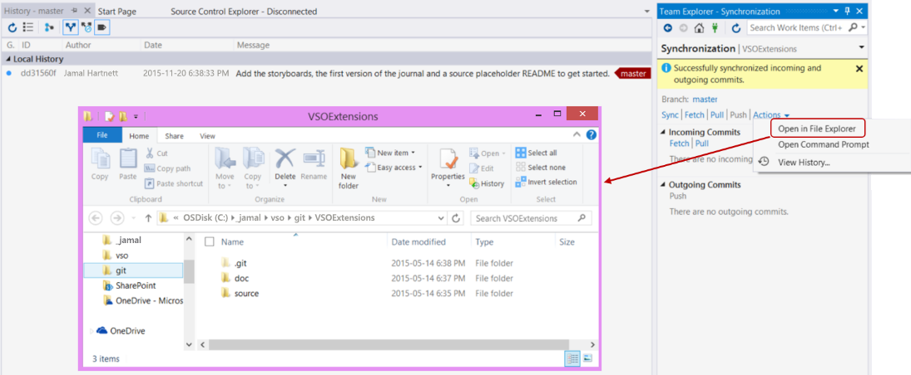
7.  Validate environment and hand-over to the team.

## **Develop** the VSTS extension

### Walkthrough of the code

The extension uses standard web technologies and ultimately is just a single HTML page which loads a JavaScript file (app.js) and has two stylesheets (app.css & print.css). The HTML file is really small, with just a placeholder div in it which the developers can add content to when the JavaScript is run.

There are two CSS files, one for rendering on the screen (app.css) which styles the content correctly to match VSTS and a second CSS file for printing specifically (print.css) which hides all the chrome of the page and adjusts the margins to make the content fit better when printing. Media queries were used to load the right stylesheet in the right scenario.

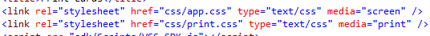

The core of the extension is the JavaScript (app.js) which ultimately does two things, get the cards information from the VSTS SDK and then render the cards to the screen.

Getting the information was very simple, the developers just called the SDK to get all the information.

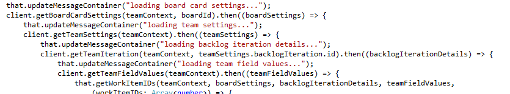

Once the information was retrieved, the developers were able to get the fields that were needed, cleaned up some of the data (like removing the email address from users' display name) and normalized it into a simplified data structure and added that to an array.

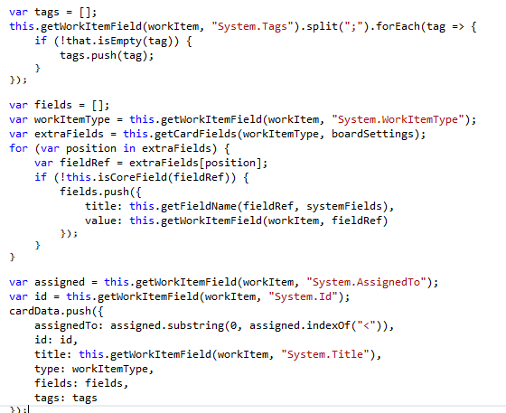

You can pass that array to a method which takes each normalised card and renders each card as a HTML 5 Canvas and places that into the HTML placeholder described above.

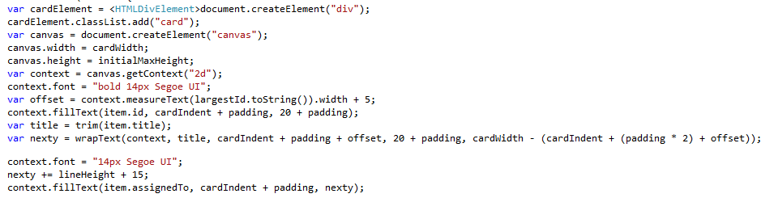

To improve development productivity, the developers decided to use LESS to develop the stylesheets and then compile that to CSS. For the code, TypeScript can be used and compiled to JavaScript. In total there were:
-   35 lines of HTML
-   90 lines of LESS
-   462 lines of TypeScript

Showing just how small a project it was.

### What it was like to develop it?

Francis and his dev team started off taking a look at the extension examples provided by the product team on [GitHub](https://github.com/Microsoft/vso-extension-samples). After playing with the samples for a while, they were ready to start with the extension and headed over to the [Integrate site](https://www.visualstudio.com/en-us/integrate/extensions/reference/targets/overview) where a list of all contribution points are listed. Note that there is, in the list of samples, an extension called **contribution guide** that has an example of all the contribution points already integrated that you can use for a jump start into writing an extension.

The next piece of the puzzle was using a tool called [Post Man](https://www.getpostman.com/) and the [Rest API site](https://www.visualstudio.com/integrate/api/overview) to quickly figure out the API’s needed to get the boardId, which they passed from the contribution point selected, through to getting a list of work items that matched that boardId.

The dev team then turned to another page on the integration's site which was the [Core client SDK page](https://www.visualstudio.com/en-us/integrate/extensions/reference/client/core-sdk) which helped link Rest API methods with SDK helper methods to get all the data that was needed.

Working with the rendering and printing was a very pleasant experience since the team could just use existing HTML knowledge, so there was nothing special about the rendering that was needed.

Cross-browser issues and finding the right way to handle printing, so it would be consistent across browsers, was the low point, but those exist with all web dev and didn’t have anything to do with it being a VSTS extension. Printing in the web is definitely years behind the HTML 5 standards and print preview cannot be trusted, so the work actually had to be printed to be tested.

### Issues & how the dev team resolved them!

#### Consistent Printing

Initially the plan was to create HTML at runtime and inject that into the placeholder, and then print that HTML. However, because the printing standards with browsers are so broken right now, the cards were seldom consistent in size and layout.

The solution to the problem was to render a HTML 5 Canvas, which is close to an image and the way browsers handle images is much more consistent.

#### IE Shrink to Fit

The team planned to support Internet Explorer which has a unique print feature called shrink to fit, which is meant to make web pages better for printing. This is on by default if using the normal JavaScript `window.print` method. To resolve this, the team had a shim for IE, using an `userAgent` compare and then run an IE specific print method. This meant that all four of the browsers officially supported would bring near consistent ways.

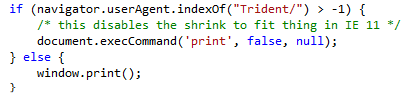

## Automate the test and build of the VSTS extension

Francis implements continuous builds, tests and deployment.

1.  Create a new build definition in VSTS.
2.  Use the default Visual Studio build. A build task and test task will automatically be added (and enabled).
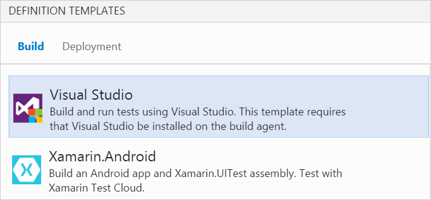

3.  To enable a gated build, click on “Triggers”, select “Continuous Integration”, then select the checkbox for “Batch changes”.

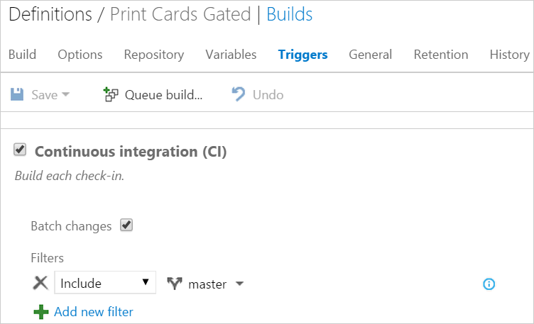

## Publish to Marketplace

The extension has been published on the VSTS Marketplace [here](https://app.market.visualstudio.com/items/ms-devlabs.PrintCards).

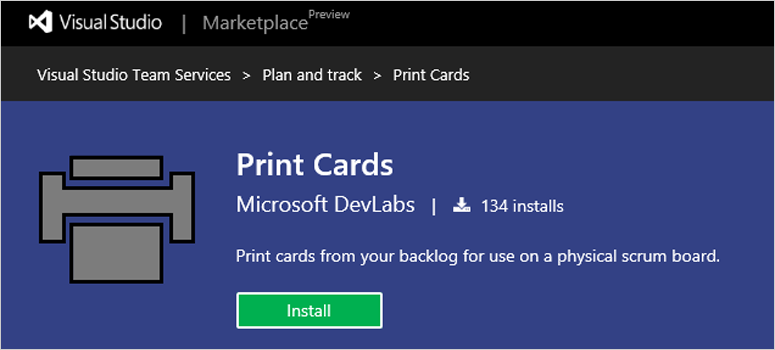

## Definition of Done (DoD)

1.  **id:** {namewithoutspaces}
2.  **Publisher:** *alm-rangers* or *dev-labs* or *personal publisher*
3.  Complete **Manifest**
4.  Sample code **header** adapted to all files created by team

5.  No Critical or High priority **bugs**.
6.  **README.MD** that defines the WHAT, WHY, PREREQUISITES and USAGE instructions.
7.  Demo **video**, 2-3 minutes, that gives a brief overview and demonstration.
8.  A nice logo and description to use on the extension catalog and in the gallery.
9.  UX Guidelines are met and reviewed by the UX Champs.
10.  Extension has been tested locally and in a personal MSDN subscription.
11.  [OPTIONAL] Document that describes the extension and how it was created, for example using Fiddler to reverse engineer protocols, and why it is important to the team.

## About the team

**Anisha Pindoria** is a Program Manager with the Visual Studio ALM Rangers team at the Redmond Microsoft campus. She is a creative person with some dev skills. You can follow her on [Twitter](http://twitter.com/anishapindoria).

**Gordon Beeming** is a Software Developer at Derivco in the sunny city of Durban, South Africa. He spends most his time hacking away at the keyboard in Visual Studio or with his family relaxing. His blog is at binary-stuff.com and you can follow him on [Twitter](http://twitter.com/gordonbeeming>).

**Robert MacLean** is a senior software developer with the AppFactory team at Microsoft South Africa. When not writing software at work, he can be found playing board games (which he owns more than 100) with his young son or trying to find solutions to improve the developer communities in South Africa. You can find out more about him on his [blog](https://about.me/robertmaclean).

**Josh Garverick** is a software architect at Inergex in Buffalo, NY. When not concocting monstrous creations in his Frankenbuild lab, he also enjoys family time and building Nodebots. Check out his [blog](http://www.inergex.com/author/jgarverick), his [Frankenbuild lab notes](http://frankenbuild.net) and you can follow him on [Twitter](http://twitter.com/jgarverick).

**Willy-Peter Schaub** is a program manager with the Visual Studio ALM Rangers at the Microsoft Canada Development Center. Since the mid-’80s, he has been striving for simplicity and maintainability in software engineering. Check out his [blog](http://blogs.msdn.com/b/willy-peter_schaub) and you can follow him on [Twitter](http://twitter.com/wpschaub).
