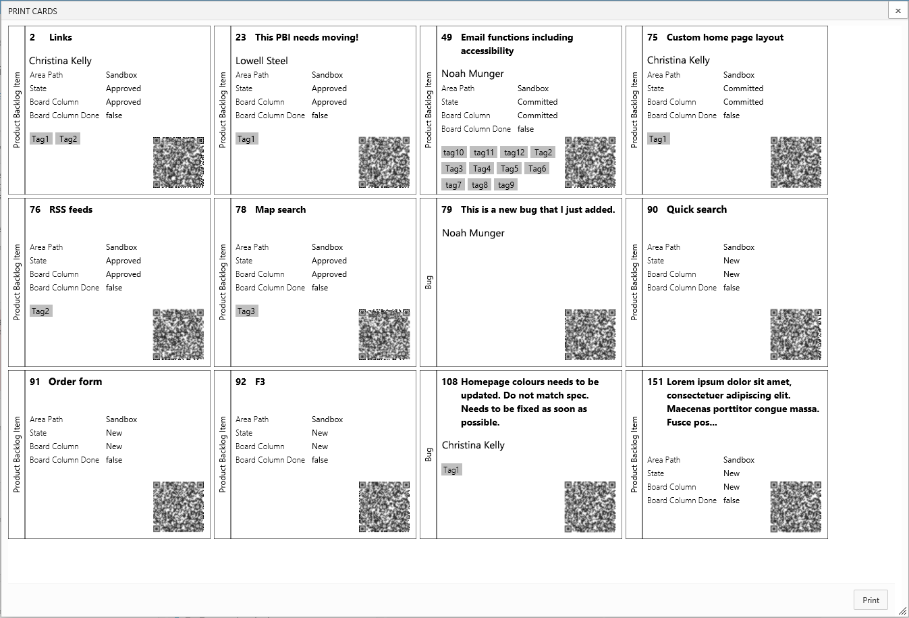

## Plan and track your work with physical cards ##

Print cards from your Kanban board for use during planning exercises with your team, or on a physical scrum board. With the addition of QR codes, you can now easily see more details on your device just by scanning the card.

This extension adds a `print` action to your backlog.

Clicking `print` opens a preview. From there you can print to a printer or save. 

## Supported browsers ##

Our supported browsers are 
- Edge 
- Internet Explorer
- Firefox 
- Chrome

Other browsers may work, provided they support HTML 5 canvas &amp; CSS 3 correctly.

### Known Issues
When using Edge on a version of Windows 10 before the November 2015 update of Windows 10 (version 10568), for this extension will NOT print correctly.

## Quick steps to get started ##

1. Navigate to your backlog board.
2. Click on the `Print Cards` icon () above the board on the right hand side (next to "Enter full screen mode").
3. Click the `Print` button to print the cards. 
4. You can scan the QR Code on each card to be taken directly to that card in your browser.

## Third Party Programs ##

The software may include third party programs that Microsoft, not the third party, licenses to you under this agreement. Notices, if any, for the third party programs are included for your information.

[View Notices](https://marketplace.visualstudio.com/_apis/public/gallery/publisher/ms-devlabs/extension/PrintCards/latest/assetbyname/ThirdPartyNotice.txt) for certain third party software included in this extension.

> Microsoft DevLabs is an outlet for experiments from Microsoft, experiments that represent some of the latest ideas around developer tools. Solutions in this category are designed for broad usage, and you are encouraged to use and provide feedback on them; however, these extensions are not supported nor are any commitments made as to their longevity.

## Contributors ##

> Microsoft DevLabs is an outlet for experiments from Microsoft, experiments that represent some of the latest ideas around developer tools. Solutions in this category are designed for broad usage, and you are encouraged to use and provide feedback on them; however, these extensions are not supported nor are any commitments made as to their longevity.

> We thank the following contributor(s) for this extension: Gordon Beeming and Robert MacLean.

